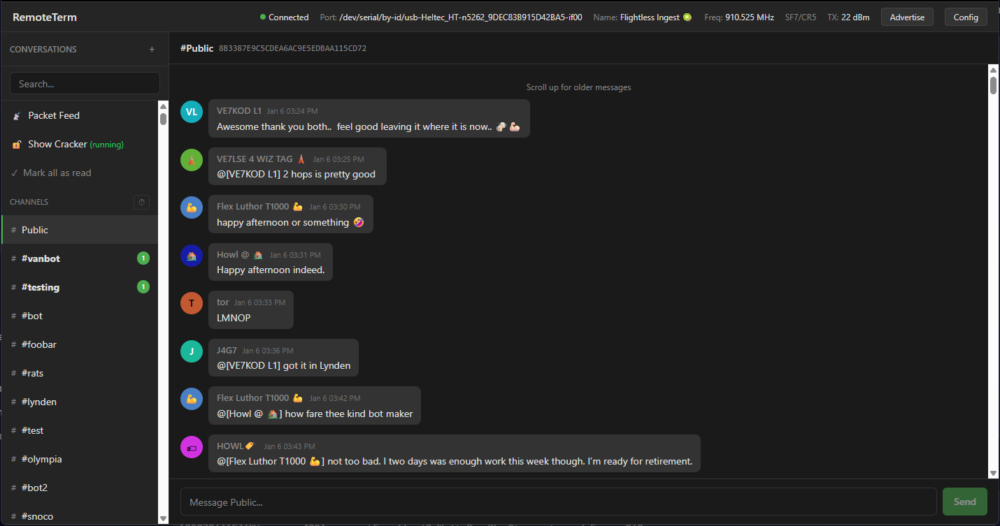

# RemoteTerm for MeshCore

Web interface for MeshCore mesh radio networks. Attach your radio over serial, and then you can:

* Send and receive DMs and GroupTexts
* Cache all received packets, decrypting as you gain keys
* Monitor unlimited contacts and channels (radio limits don't apply—packets are decrypted server-side)
* Access your radio remotely over your network or VPN
* Brute force hashtag room names for GroupTexts you don't have keys for yet

**Warning:** This app has no authentication. Run it on a private network only—do not expose to the internet unless you want strangers sending traffic as you.



## Disclaimer

This is a personal toolkit, not optimized for general consumption. Entirely vibecoded slop—no warranty of fitness for any purpose.

If extending, read the three `CLAUDE.md` files: `./CLAUDE.md`, `./frontend/CLAUDE.md`, and `./app/CLAUDE.md`.

## Requirements

- Python 3.10+
- Node.js 18+ (for frontend development only)
- [UV](https://astral.sh/uv) package manager: `curl -LsSf https://astral.sh/uv/install.sh | sh`
- MeshCore radio connected via USB serial

**Find your serial port:**
```bash
# Linux
ls /dev/ttyUSB* /dev/ttyACM*

# macOS
ls /dev/cu.usbserial-* /dev/cu.usbmodem*
```

## Quick Start

**This approach is recommended over Docker due to intermittent serial communications issues I've seen on \*nix systems.**

The frontend is pre-built -- just run the backend:

```bash
git clone https://github.com/jkingsman/Remote-Terminal-for-MeshCore.git
cd Remote-Terminal-for-MeshCore

uv sync
uv run uvicorn app.main:app --host 0.0.0.0 --port 8000
```

The server auto-detects the serial port. To specify manually:
```bash
MESHCORE_SERIAL_PORT=/dev/ttyUSB0 uv run uvicorn app.main:app --host 0.0.0.0 --port 8000
```

Access at http://localhost:8000

> **Note:** WebGPU cracking requires HTTPS when not on localhost. See the HTTPS section under Additional Setup.

## Docker

> **Warning:** Docker has intermittent issues with serial event subscriptions. The native method above is more reliable.

```bash
docker run -d \
  --device=/dev/ttyUSB0 \
  -v remoteterm-data:/app/data \
  -p 8000:8000 \
  jkingsman/remote-terminal-for-meshcore:latest
```

## Development

### Backend

```bash
uv sync
uv run uvicorn app.main:app --reload

# Or with explicit serial port
MESHCORE_SERIAL_PORT=/dev/ttyUSB0 uv run uvicorn app.main:app --reload
```

### Frontend

```bash
cd frontend
npm install
npm run dev      # Dev server at http://localhost:5173 (proxies API to :8000)
npm run build    # Production build to dist/
```

Run both the backend and `npm run dev` for hot-reloading frontend development.

## Configuration

| Variable | Default | Description |
|----------|---------|-------------|
| `MESHCORE_SERIAL_PORT` | (auto-detect) | Serial port path |
| `MESHCORE_SERIAL_BAUDRATE` | 115200 | Baud rate |
| `MESHCORE_LOG_LEVEL` | INFO | DEBUG, INFO, WARNING, ERROR |
| `MESHCORE_DATABASE_PATH` | data/meshcore.db | SQLite database path |
| `MESHCORE_MAX_RADIO_CONTACTS` | 200 | Max recent contacts to keep on radio for DM ACKs |

## Additional Setup

<details>
<summary>HTTPS (Required for WebGPU Cracking outside localhost)</summary>

WebGPU requires a secure context. When not on `localhost`, serve over HTTPS:

```bash
openssl req -x509 -newkey rsa:4096 -keyout key.pem -out cert.pem -days 365 -nodes -subj '/CN=localhost'
uv run uvicorn app.main:app --host 0.0.0.0 --port 8000 --ssl-keyfile=key.pem --ssl-certfile=cert.pem
```

For Docker:

```bash
# generate TLS cert
openssl req -x509 -newkey rsa:4096 -keyout key.pem -out cert.pem -days 365 -nodes -subj '/CN=localhost'

# run with cert
docker run -d \
  --device=/dev/ttyUSB0 \
  -v remoteterm-data:/app/data \
  -v $(pwd)/cert.pem:/app/cert.pem:ro \
  -v $(pwd)/key.pem:/app/key.pem:ro \
  -p 8000:8000 \
  jkingsman/remote-terminal-for-meshcore:latest \
  uv run uvicorn app.main:app --host 0.0.0.0 --port 8000 --ssl-keyfile=/app/key.pem --ssl-certfile=/app/cert.pem
```

Accept the browser warning, or use [mkcert](https://github.com/FiloSottile/mkcert) for locally-trusted certs.
</details>

<details>
<summary>Systemd Service (Linux)</summary>

```bash
# Create service user
sudo useradd -r -m -s /bin/false remoteterm

# Install to /opt/remoteterm
sudo mkdir -p /opt/remoteterm
sudo cp -r . /opt/remoteterm/
sudo chown -R remoteterm:remoteterm /opt/remoteterm

# Install dependencies
cd /opt/remoteterm
sudo -u remoteterm uv venv
sudo -u remoteterm uv sync

# Build frontend (optional—already built in repo)
cd /opt/remoteterm/frontend
sudo -u remoteterm npm install
sudo -u remoteterm npm run build

# Install and start service
sudo cp /opt/remoteterm/remoteterm.service /etc/systemd/system/
sudo systemctl daemon-reload
sudo systemctl enable --now remoteterm

# Check status
sudo systemctl status remoteterm
sudo journalctl -u remoteterm -f
```

Edit `/etc/systemd/system/remoteterm.service` to set `MESHCORE_SERIAL_PORT` if needed.
</details>

<details>
<summary>Testing</summary>

**Backend:**
```bash
PYTHONPATH=. uv run pytest tests/ -v
```

**Frontend:**
```bash
cd frontend
npm run test:run
```
</details>

## API Documentation

With the backend running: http://localhost:8000/docs
